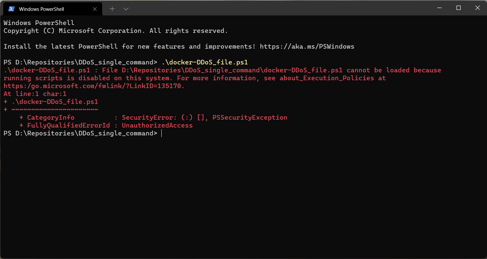
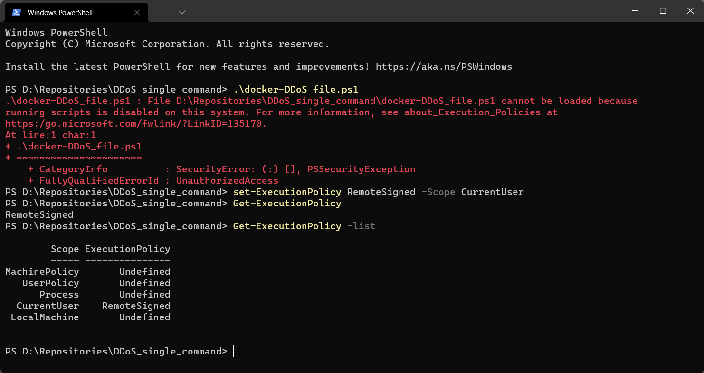

# DDoS_single_command
 
Народ, хто з докера дудосить та з вінди, я вирішив спростити нам життя, в архіві 2 файла: 
* .ps1 — сам скріпт, можна викликати через 
    ```
    .\docker-DDoS_file.ps1
    ```
    з PowerShell або командою 
    ```
    powershell.exe -noexit '.\docker-DDoS_file.ps1'
    ```
    з cmd

* .txt — інструкції для контейнера докера, там є через "#" написані коментарі, що має бути нижче стрічкою за дані, потім самі дані. Спочатку йде тривалість дудосу (однакова на всі цілі), а потім самі цілі (довільна кількість).

Я це зробив, щоб простіше було забивати кілька цілей, ви копіюєте з чату, вставляєте в файлик і вуаля — всі бомбляться (не залишайте, будь ласка, порожніх строк у тестовому файлі та не ставте зайвих "ентерів"

P.S.: якщо вставилося з пробілами між IP та портом — нічого, з цим скріпт впорається. Бажано спочатку 1 раз докером запуститися командою вручну:
docker run -ti --rm alpine/bombardier -c 10000 -d (тривалість)s -l  (адреса цілі)
І звісно ж умова встановлення докера на ПК не знімається.

Чекатиму фідбеку

# Поширені проблеми

Якщо cmd мовчить, а PowerShell виводить подібне:



Наступні команди повинні допомогти:

```
Set-ExecutionPolicy -Scope CurrentUser -ExecutionPolicy Bypass -Force
```

```
Get-ExecutionPolicy
```

```
Get-ExecutionPolicy -list  
```

Вивід повинен виглядати приблизно наступним чином:



Після цього спробуйте знову, все повинно працювати як слід.
___
Щоб повернути все як було введіть:

```
set-ExecutionPolicy Restricted -Scope CurrentUser
```