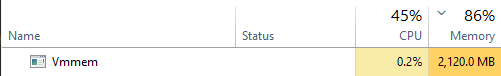
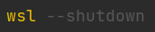
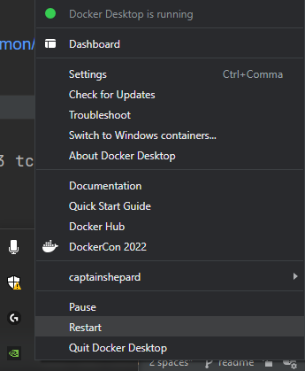

# DDoS_single_command
 
Народ, хто з докера дудосить та з вінди, я вирішив спростити нам життя: 
* start.py — запуск скріпта з Python
    ``` 
    python start.py
    ```

* commands.txt — інструкції для контейнера докера

Я це зробив, щоб простіше було забивати кілька цілей, ви копіюєте з чату, вставляєте в файлик у відповідному форматі і 
вуаля — всі бомбляться (не залишайте, будь ласка, порожніх строк у тестовому файлі та не ставте зайвих "ентерів"

Чекатиму фідбеку

# Поширені проблеми

* Під час виконання буде процес під назвою Vmmem, з часом він може жерти багато ОЗП:

  

  Фікситься прописуванням наступної команди в терміналі:

  

  (після цього перезапустіть докер)

* Є ще один процес, називається vpnkit.exe, він теж з часом починає жерти багато ОЗП:

  
  
  Фікситься перезапуском докера:

  

За основу взято docker image [porthole-ascend-cinnamon/mhddos_proxy](https://github.com/porthole-ascend-cinnamon/mhddos_proxy),
я лишень додав налаштування через файл :)